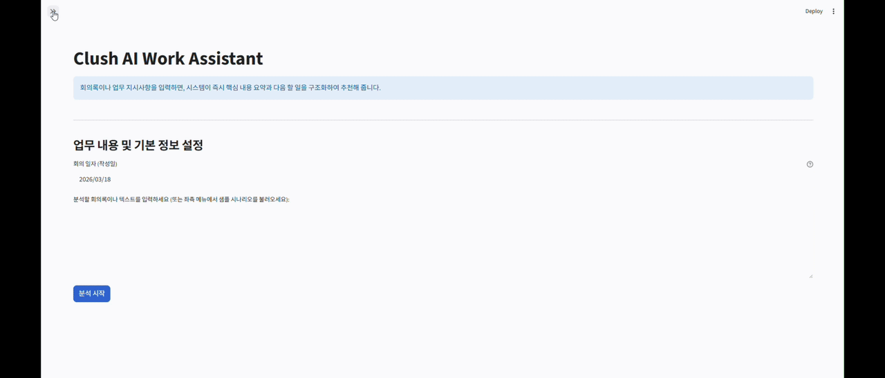
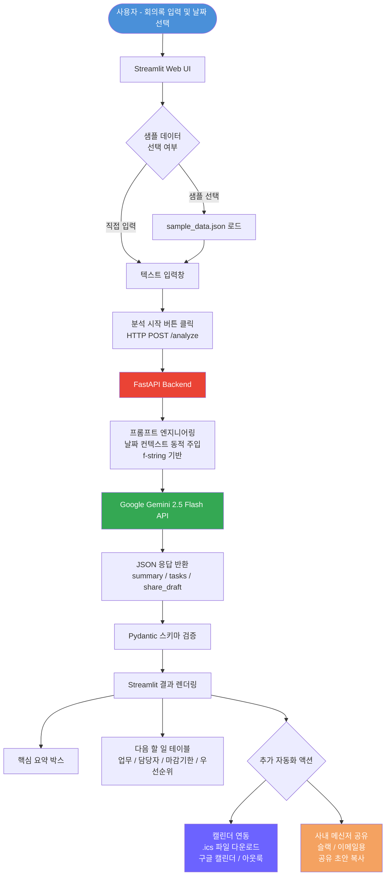

# 🚀 AI Work Assistant (업무 요약 & 액션 추천 시스템)

## 🎬 데모 영상

> 아래 영상은 실제 회의록 텍스트를 입력했을 때, AI가 즉시 핵심 요약 / 담당자별 할 일 / 캘린더 연동 / 팀 공유 초안을 생성하는 전체 흐름을 보여줍니다.

<div align="center">
  
</div>

### 데모에서 확인할 수 있는 핵심 기능 3가지

| 순서 | 기능 | 설명 |
|:---:|---|---|
| **1** | 회의록 요약 및 할 일 추출 | 구어체 회의록을 입력하면 핵심 내용 요약과 담당자별 Action Item을 자동으로 구조화 |
| **2** | 기준일 기반 마감 기한 도출 | 회의 일자를 설정하면 "내일", "이번 주 금요일" 등을 실제 캘린더 날짜로 자동 변환 |
| **3** | 캘린더 연동 & 팀 공유 초안 생성 | .ics 파일 다운로드로 구글/아웃룩 일정 자동 등록, 슬랙/이메일용 공유 문서 원클릭 복사 |

---

## 📌 1. 프로젝트 개요 (Overview)

* **목표:** Clush의 협업 포털(WorkPlace) 내 반복적인 텍스트 기반 업무(회의록 요약, 할 일 분배 등)를 자동화하는 MVP 구현.
* **기대 효과:** 단순 정보 전달 시간을 단축하고, 실행해야 할 Task를 명확히 도출하여 조직의 커뮤니케이션 비용 감소 및 실행력 강화.
* **접근 전략:** "기술 실증"이 아닌 "Clush WorkPlace의 기능을 고도화할 비즈니스 솔루션"으로서의 가치 입증에 집중.

## 🛠 2. 기술 스택 (Tech Stack)

* **Frontend (Web UI):** `Streamlit` (빠르고 직관적인 데모 환경 구축)
* **Backend (API):** `FastAPI` (마이크로서비스 구조에 적합한 빠른 응답 속도 및 확장성 보장)
* **AI Model:** `Google Gemini API (gemini-1.5-flash 또는 gemini-2.0-flash)`
  * *선정 이유:* 엔터프라이즈 환경에서 무거운 모델 사용 시 발생하는 비용 및 속도 지연 문제를 해결하기 위해, 응답 속도가 빠르고 긴 문맥(회의록 등) 처리에 탁월한 **경량화 모델(Flash 계열)**을 채택.

## 🏗 3. 시스템 아키텍처 (Architecture)

1. **User (Streamlit Web):** 사용자가 회의록이나 업무 전달 사항 텍스트를 입력 (미리 준비된 샘플 데이터 선택 가능).
2. **API Request (FastAPI):** Streamlit Web이 FastAPI 백엔드로 텍스트 데이터 전송.
3. **AI Processing (Gemini API):** FastAPI 서버가 프롬프트를 구성하여 Gemini 모델 호출.
   * [핵심 기능 1] 회의 내용 핵심 요약 및 Action Item (담당자별 할 일) 추출
   * [핵심 기능 2] 우선순위 판별 및 동적 마감 기한 도출
   * [핵심 기능 3] 달력에 일정 추가 및 팀 전파용 사내 메신저(이메일) 공유 초안 자동 작성
4. **Dashboard:** AI가 분석한 결과를 JSON 형태로 파싱하여 Streamlit UI 기반의 가독성 좋은 테이블과 박스로 데이터 시각화.
5. **Sync Automation:** 도출된 각 Task의 일정을 바탕으로 `.ics` 달력 파일을 다운로드 생성하여 구글 캘린더 및 아웃룩 일정표에 즉각 연동 가능.

### 시스템 흐름도 (Flowchart)



## 📂 4. 데이터 활용 방안 (Data Strategy)

진짜 실무에서 쓰이는 것 같은 데모 시연을 위해, 가상의 **협업 시나리오 샘플 데이터(Mock Data)** 3가지를 자체적으로 구축하여 데모의 완성도를 높입니다.

* **시나리오 1. 개발팀 스프린트 플래닝 회의록**
  * 로그인 버그 우선 처리 및 결제 모듈 연동 지연에 따른 담당자별 일정 조율 내용.
* **시나리오 2. 마케팅팀 예산 조정 회의**
  * 이번 분기 목표 미달로 인한 오프라인 예산 축소 및 SNS 광고 예산 확대 논의 내용.
* **시나리오 3. CS팀 고객 불만 대응 지시사항**
  * VIP 고객 클레임에 대한 환불 절차 진행 및 향후 정책 변경 논의 내용.

*(구현 방식)*: `sample_data/` 디렉토리에 텍스트나 JSON 형태로 저장해 두고, Streamlit 화면에서 드롭다운(Selectbox)으로 선택하면 즉시 텍스트 영역에 로드되도록 구성.

## 🎯 5. Clush 면접 타겟팅 포인트 결론

이 미니 프로젝트를 통해 달성하고자 하는 어필 포인트입니다:

1. **비즈니스 이해도:** Clush의 WorkPlace 제품이 해결해야 할 고객의 Pain Point를 정확히 짚어냄.
2. **풀스택 아키텍처 역량:** 프론트(Streamlit) - 백엔드(FastAPI) - AI(Gemini API)로 이어지는 실무형 인프라 구조를 직접 설계하고 구현함.
3. **최적화 마인드:** 속도와 비용을 고려한 경량화 모델 선택과, 프롬프트 엔지니어링을 통한 데이터 정제 역량 증명.

---

## 🚀 6. 빠른 실행 가이드 (Quick Start)

면접관 시연이나 로컬 테스트를 위해 백엔드와 프론트엔드 두 마이크로서비스를 각각 실행하는 방법입니다.

### 1️⃣ 패키지 설치 (최초 1회)

```bash
pip install -r requirements.txt
```

### 2️⃣ 환경변수 세팅

프로젝트 루트의 `.env` 파일을 열고 발급받은 Gemini API 키를 입력되어 있는지 확인합니다.

### 3️⃣ 백엔드 서버 구동 (FastAPI)

터미널을 열고 서버를 작동시킵니다. (8000번 포트 구동)

```bash
uvicorn backend.main:app --reload
```

*(Tip: 브라우저에서 `http://localhost:8000/docs`에 접속하면 Swagger API 자동 생성 문서도 시연 가능!)*

### 4️⃣ 프론트엔드 서버 구동 (Streamlit)

**[새로운 터미널 창]**을 하나 더 열어 웹 대시보드를 구동합니다. (8501번 포트)

```bash
streamlit run frontend/app.py
```

*명령어를 치면 브라우저가 자동으로 열리며, 멋진 Clush AI Work Assistant 대시보드를 시연하실 수 있습니다!*
