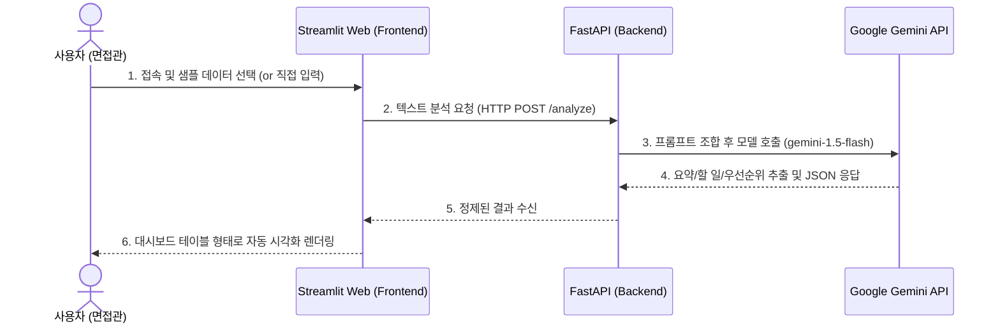

# 🗺️ AI Work Assistant 개발 순서도 (Action Plan)

이 문서는 AI Work Assistant(업무 요약 & 액션 추천 시스템)의 MVP를 2시간 이내에 완성하기 위한 단계별 실행 계획입니다.

## 📊 전체 시스템 흐름도

## 📋 단계별 개발 체크리스트 (프로젝트 구축 완료)

### 🔹 STEP 1: 환경 설정 및 가상 데이터(Mock Data) 구축 (✅완료)
- [x] 프로젝트 디렉토리 구조 셋업 (`backend/`, `frontend/`, `data/`) 분리
- [x] 필수 라이브러리 목록(`requirements.txt`) 작성
- [x] 면접관 시연용 3가지 비즈니스 시나리오 텍스트 원본 생성 (`sample_data.json`)

### 🔹 STEP 2: FastAPI 백엔드 개발 (`backend/main.py`) (✅완료)
- [x] `.env` 보안 환경 변수 체계 세팅
- [x] Pydantic으로 강력한 Request & Response 스키마 검증 구축
- [x] Gemini API 프롬프트 엔지니어링 (JSON만 뱉도록 가드레일 설정)
- [x] 비동기(Async) HTTP POST `/analyze` 라우터 구현
- [x] 프론트엔드 허용을 위한 전역 CORS 미들웨어 부착

### 🔹 STEP 3: Streamlit 프론트엔드 개발 (`frontend/app.py`) (✅완료)
- [x] 사이드바(Sidebar) 데모 시나리오 로더 연동
- [x] 프론트엔드 ↔ 백엔드 간 REST API 통신(`requests`) 파이프라인
- [x] 수신 JSON 데이터의 화면 시각화 (`st.info`, `st.table` 기반 대시보드화)
- [x] 인터랙티브 통신 장애 에러 트래킹 화면 및 예외 처리 구현

### 🔹 STEP 4: 최종 테스트 및 실행 매뉴얼 연동 (✅완료)
- [x] 포트폴리오 메인 문서(`README.md`) 하단에 서버 2개 병렬 구동 '빠른 실행 가이드(Quick Start)' 연동
- [x] 모든 개발 프로세스 무결성 검증 종료
